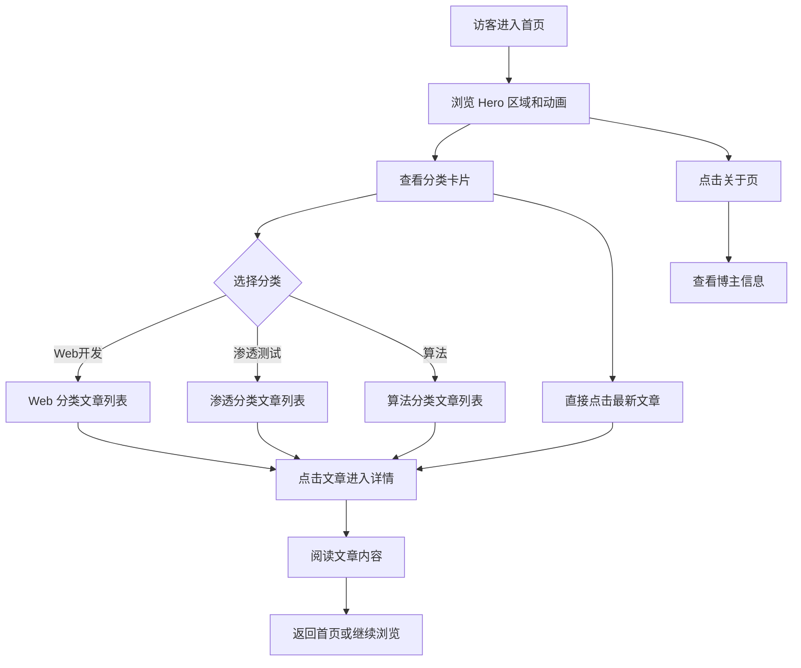

## 1. 产品概述

一个聚焦 Web 开发、渗透测试与算法三大技术领域的个人博客网站，采用赛博朋克风格的暗色调设计，为技术爱好者提供沉浸式的阅读体验和炫酷的视觉冲击。

- **目标用户**：对 Web 前端/后端开发、网络安全渗透、算法数据结构感兴趣的技术人员和学生。
- **核心价值**：将三个看似独立的技术领域融合在同一平台上，通过极具辨识度的赛博朋克美学，打造一个让人过目不忘的技术博客。

## 2. 核心功能

### 2.1 用户角色

| 角色 | 说明 |
|------|------|
| 访客 | 浏览所有博客文章，无需注册 |

### 2.2 功能模块

1. **首页（Hero + 文章列表）**：导航栏、全屏 Hero 区域（含粒子/矩阵动画背景）、三大分类卡片入口、精选文章列表
2. **文章详情页**：文章内容渲染、分类标签、代码高亮、阅读进度条、返回导航
3. **分类筛选页**：按 Web/渗透/算法分类浏览文章列表，侧边栏筛选
4. **关于页**：博主个人信息、技能雷达、联系方式

### 2.3 页面详情

| 页面名称 | 模块名称 | 功能描述 |
|----------|----------|----------|
| 首页 | 导航栏 | 固定顶部，Logo + Web/渗透/算法/关于四个导航链接，半透明毛玻璃效果 |
| 首页 | Hero 区域 | 全屏高度，Canvas 粒子动画背景，打字机效果标题，副标题渐变文字，CTA 按钮 |
| 首页 | 分类卡片 | 三张分类卡片（Web/渗透/算法），悬停 3D 翻转效果，不同霓虹色边框 |
| 首页 | 文章列表 | 最新 6 篇文章，卡片式布局，含标题/摘要/日期/标签，悬停发光效果 |
| 分类页 | 文章筛选 | 按 Web/渗透/算法 筛选，文章卡片列表，带标签和摘要 |
| 详情页 | 文章内容 | Markdown 风格渲染，代码块带语法高亮和暗色终端风格背景 |
| 详情页 | 阅读进度 | 顶部阅读进度条，霓虹色渐变 |
| 关于页 | 个人信息 | 头像、简介、技能标签云、GitHub 等技术链接 |

## 3. 核心流程

## 4. 用户界面设计

### 4.1 设计风格

- **主色调**：深色背景 `#0a0a12`（接近纯黑），霓虹青色 `#00f0ff` 作为主强调色
- **辅助色**：霓虹品红 `#ff00aa`（渗透分类）、霓虹绿 `#00ff88`（算法分类）、金色 `#ffaa00`（Web 分类）
- **按钮风格**：描边发光按钮，边框带 glow 效果，hover 时填充发光
- **字体**：标题使用 `Orbitron`（科技感无衬线字体），正文使用 `JetBrains Mono`（代码等宽字体），搭配 `Noto Sans SC` 中文回退
- **布局风格**：卡片式 + 非对称布局，顶部固定导航 + 毛玻璃效果
- **动画**：粒子背景、打字机效果、卡片 3D 翻转、扫描线效果、霓虹闪烁、滚动触发渐入

### 4.2 页面设计概览

| 页面名称 | 模块名称 | UI 元素 |
|----------|----------|--------|
| 首页 | 导航栏 | 固定顶部，毛玻璃半透明深色背景，左侧 Logo 霓虹发光，右侧链接 hover 下滑线动画 |
| 首页 | Hero 区域 | 全屏 Canvas 粒子矩阵背景，居中大标题打字机动画，副标题渐变色，下箭头脉动指示器 |
| 首页 | 分类卡片 | 三列卡片，磨砂玻璃背景，不同霓虹色边框，悬停 3D 微翻转 + 发光增强 |
| 首页 | 文章列表 | 两列网格布局，暗色卡片，左边框霓虹色条，hover 整体发光 |
| 分类页 | 文章筛选 | 顶部标签 Tab 切换，下方文章列表，带搜索框 |
| 详情页 | 文章内容 | 居中文档式布局，代码块暗色终端风格，行号显示，顶部进度条 |
| 关于页 | 个人信息 | 居中卡片，技能标签云（不同霓虹色），社交链接图标 |

### 4.3 响应式设计

- Desktop-first 设计，适配 1920px / 1440px / 1024px 主流分辨率
- 平板（768px-1024px）：卡片改为单列，字体适当缩小
- 手机（<768px）：导航变为汉堡菜单，Hero 高度减半，卡片单列

### 4.4 特效与动画

- **粒子矩阵背景**：Canvas 绘制随机降落的绿色/青色字符（Matrix rain 风格），叠加扫描线效果
- **打字机效果**：Hero 标题逐字显现，光标闪烁
- **卡片 hover**：`transform: perspective(800px) rotateY(2deg) rotateX(-2deg)` 3D 微翻转
- **滚动动画**：Intersection Observer 触发元素淡入上移
- **霓虹闪烁**：关键帧 animation 模拟霓虹灯管微闪
- **阅读进度条**：顶部固定细条，从青色渐变到品红