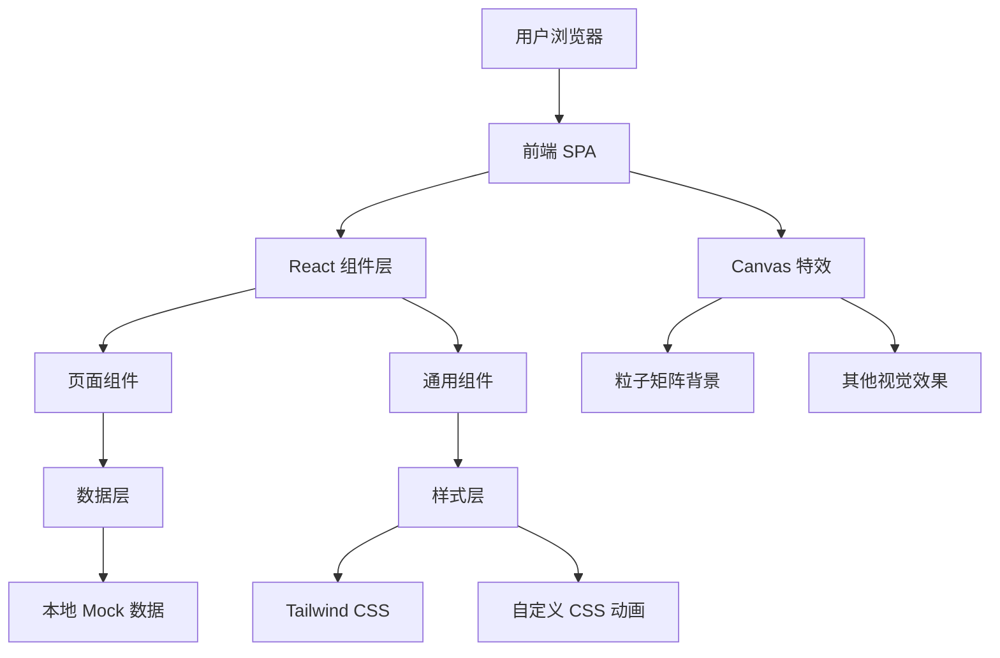

## 1. 架构设计



本项目为纯前端静态博客，无需后端和数据库。使用 React + TypeScript + Vite + Tailwind CSS 技术栈构建单页应用，所有文章数据通过本地 TypeScript 文件模拟。

## 2. 技术说明

- **前端框架**：React@18 + TypeScript
- **构建工具**：Vite
- **样式方案**：Tailwind CSS@3
- **路由**：react-router-dom@6
- **状态管理**：zustand（管理分类筛选状态和主题）
- **图标库**：lucide-react
- **字体**：Google Fonts（Orbitron + JetBrains Mono + Noto Sans SC）
- **数据**：本地 TypeScript 文件定义 Mock 数据

## 3. 路由定义

| 路由 | 页面 | 说明 |
|------|------|------|
| `/` | 首页 | Hero + 分类卡片 + 最新文章列表 |
| `/category/:slug` | 分类页 | 按 Web/渗透/算法 筛选文章 |
| `/article/:id` | 文章详情页 | 文章完整内容展示 |
| `/about` | 关于页 | 博主个人信息 |

## 4. 组件树

```
App
├── Layout
│   ├── Navbar（固定顶部导航）
│   ├── MatrixBackground（Canvas 粒子背景）
│   └── ScanLine（扫描线效果）
├── Pages
│   ├── HomePage
│   │   ├── HeroSection（打字机标题 + CTA）
│   │   ├── CategoryCards（三张分类卡片）
│   │   └── ArticleList（最新文章）
│   ├── CategoryPage
│   │   ├── CategoryTabs（分类 Tab 切换）
│   │   └── ArticleGrid（文章网格）
│   ├── ArticlePage
│   │   ├── ProgressBar（阅读进度条）
│   │   └── ArticleContent（Markdown 风格内容）
│   └── AboutPage
│       ├── ProfileCard（个人信息卡片）
│       ├── SkillCloud（技能标签云）
│       └── SocialLinks（社交链接）
└── Common Components
    ├── ArticleCard（文章卡片）
    ├── GlowButton（发光按钮）
    ├── NeonBorder（霓虹边框）
    └── Typewriter（打字机文字）
```

## 5. 数据模型

```typescript
interface Article {
  id: string
  title: string
  summary: string
  content: string        // Markdown 格式内容
  category: 'web' | 'pentest' | 'algorithm'
  tags: string[]
  date: string           // ISO 日期格式
  readTime: number       // 预计阅读分钟数
  featured: boolean      // 是否精选/置顶
}

interface Category {
  slug: string
  name: string
  description: string
  icon: string           // lucide 图标名称
  color: string          // 霓虹色 hex 值
}

interface BlogData {
  articles: Article[]
  categories: Category[]
}
```

### 示例数据

```typescript
const categories: Category[] = [
  { slug: 'web', name: 'Web 开发', description: '前端与后端技术探索', icon: 'Globe', color: '#ffaa00' },
  { slug: 'pentest', name: '渗透测试', description: '网络安全与漏洞挖掘', icon: 'Shield', color: '#ff00aa' },
  { slug: 'algorithm', name: '算法', description: '数据结构与算法精进', icon: 'Binary', color: '#00ff88' },
]
```